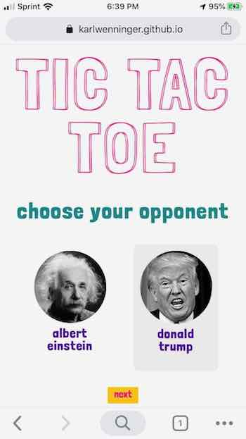

[Play Tic-Tac-Toe!](https://karlwenninger.github.io/tic-tac-toe//)	

 

## Tic-Tac-Toe

Play against 'opponents' Albert Einstein or Donald Trump. Einstein is unbeatable—he wins or you tie. The Trump 'player' switches between the unbeatable algorithm and completely random moves. As a result Trump is erratic and unpredictable. 

### PLEASE NOTE:
I put this together summer 2019—*before* all the absolute chaos of 2020-21. A revison is on my to do list.  

## Built With

* JavaScript
* CSS
* HTML

## Authors

* **Karl Wenninger** - *Initial work* - [karlWenninger](https://github.com/karlWenninger)

## License

This project is licensed under the MIT License - see the [LICENSE.md](LICENSE.md) file for details
